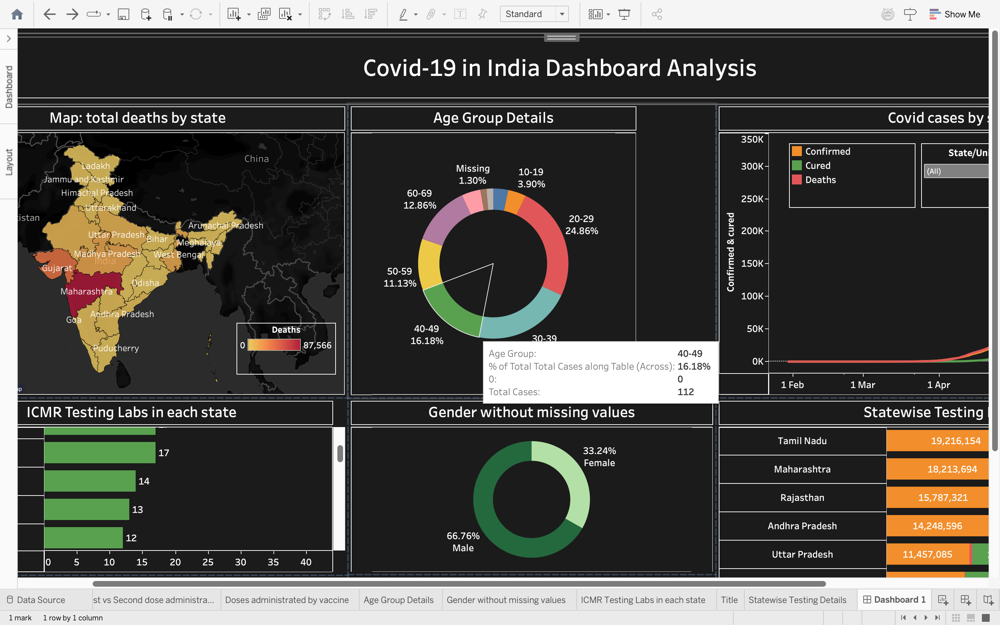
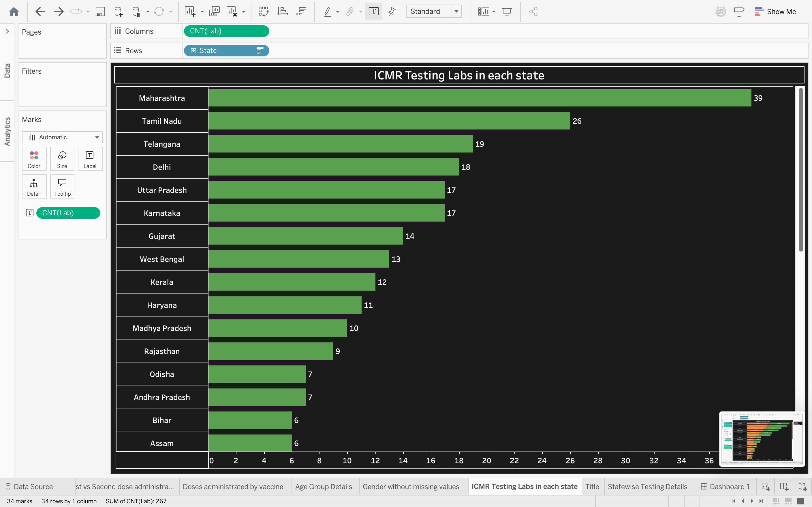
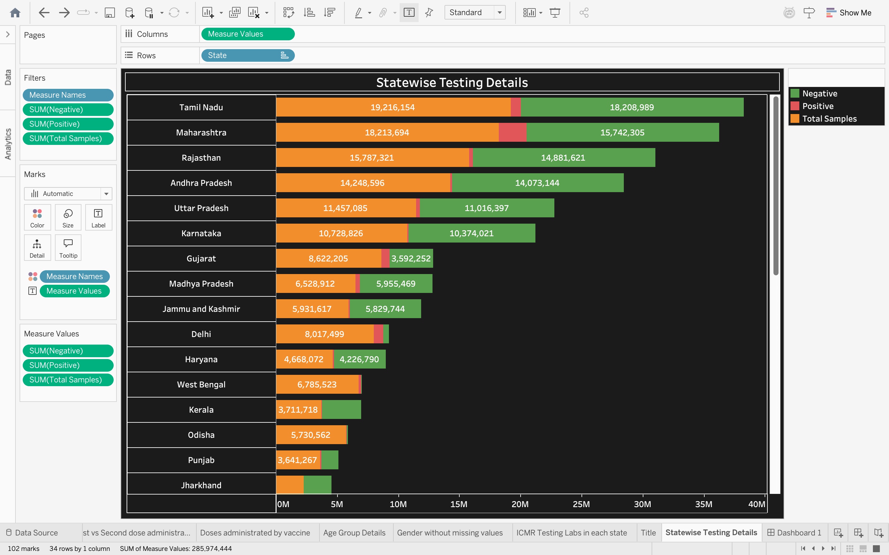

<div align="center">

#  Covid-19 in India — Dashboard Analysis

**A comprehensive Tableau dashboard analyzing COVID-19 spread, testing, vaccination & demographics across all Indian states and Union Territories.**

[](https://public.tableau.com/)
[](https://www.kaggle.com/datasets/sudalairajkumar/covid19-in-india)
[](LICENSE)

</div>

---

## 📌 Project Overview

This project was built as part of a **Tableau for Beginners** YouTube tutorial series. It demonstrates how to connect multiple CSV data sources, build individual analysis sheets, and assemble them into a polished, interactive dashboard — all using **Tableau Public** (free).

The dashboard covers **10 interactive sheets** combined into one final view, tracking COVID-19 across India from early 2020 onwards.


---

## 📊 Dashboard Preview

### 🖥️ Final Dashboard — All Sheets Assembled



> *Interactive dashboard combining the map, age group donut, gender donut, ICMR labs bar chart, statewise testing table, and covid trend line chart.*

---

### 🟢 ICMR Testing Labs in Each State



> *Horizontal bar chart showing the number of ICMR-approved testing labs per state. Maharashtra leads with **39 labs**, followed by Tamil Nadu (26) and Telangana (19).*

---

### 📊 Statewise Testing Details



> *Stacked horizontal bar chart displaying **Total Samples**, **Positive**, and **Negative** COVID-19 test results per state. Tamil Nadu tops with ~19.2M total samples.*

---

## 🗂️ Repository Structure

```
covid-19-india-dashboard/
│
├── 📄 README.md                        ← You are here
├── 📄 .gitignore
├── 📄 LICENSE
│
├── 📁 data/
│   └── 📄 README.md                    ← Dataset download links (Kaggle)
│
├── 📁 tableau/
│   ├── 📄 README.md                    ← How to open the workbook
│   └── 📦 Covid19_India_Dashboard.twbx ← Tableau packaged workbook
│
├── 📁 assets/
│   └── 📁 screenshots/                 ← Dashboard preview images
│       ├── dashboard_overview.png
│       ├── icmr_labs_chart.png
│       └── statewise_testing.png
│
└── 📁 docs/
    └── 📄 data_dictionary.md           ← Field descriptions for all CSVs
```

---

## 📈 Dashboard Sheets

| # | Sheet | Chart Type | Description |
|---|---|---|---|
| 1 | **Title** | Text | Project title slide |
| 2 | **Map: Total Deaths by State** | Filled Map | Heat-map showing cumulative deaths per state |
| 3 | **Age Group Details** | Donut Chart | % breakdown of cases by age band (20–29 = 24.86%) |
| 4 | **Covid Cases by State/UT** | Dual-Axis Line | Confirmed, Cured & Deaths trend over time |
| 5 | **ICMR Testing Labs in each State** | Horizontal Bar | Lab count per state (Maharashtra leads with 39) |
| 6 | **Gender without Missing Values** | Donut Chart | Male 66.76% vs Female 33.24% |
| 7 | **Statewise Testing Details** | Stacked H-Bar | Total Samples, Positive & Negative per state |
| 8 | **1st vs 2nd Dose Administration** | Bar Chart | Vaccine dose comparison by state |
| 9 | **Doses Administered by Vaccine** | Bar Chart | Covaxin, Covishield & Sputnik V breakdown |
| 10 | **Dashboard 1** | Dashboard | All sheets assembled into final view |

---

## 🗃️ Data Sources

All datasets are sourced from **Kaggle** — no CSV files are committed to this repo to keep it lightweight. See [`data/README.md`](data/README.md) for full download instructions.

| Dataset | Source |
|---|---|
| COVID-19 India (cases, labs, testing, age, gender) | [Kaggle — sudalairajkumar](https://www.kaggle.com/datasets/sudalairajkumar/covid19-in-india) |
| COVID Vaccine Statewise | [Kaggle — anmolkumar](https://www.kaggle.com/datasets/anmolkumar/covid19-vaccine-statewise) |
| India States Shapefile (optional, for map) | [GADM India Boundaries](https://gadm.org/download_country.html) |

**Files used:**

| File | Description |
|---|---|
| `covid_19_india.csv` | Date-wise confirmed/cured/deaths per state |
| `ICMRTestingLabs.csv` | ICMR lab count per state |
| `StatewiseTestingDetails.csv` | Total, positive & negative test samples per state |
| `AgeGroupDetails.csv` | Cases broken down by age band |
| `IndividualDetails.csv` | Individual records used for gender chart |
| `covid_vaccine_statewise.csv` | 1st & 2nd dose vaccination data per state |

---

## 🚀 How to Use This Project

### Prerequisites
- [Tableau Public](https://public.tableau.com/app/discover) (free) **or** Tableau Desktop

### Steps

1. **Clone this repository**
   ```bash
   git clone https://github.com/Utkarsh00123/Covid-19-in-india-dashboard.git
   cd Covid-19-in-india-dashboard
   ```

2. **Download the datasets**

   Follow the instructions in [`data/README.md`](data/README.md) to download all CSV files into the `data/` folder.

3. **Open the Tableau workbook**
   ```
   tableau/Covid19_India_Dashboard.twbx
   ```
   Double-click the `.twbx` file — Tableau will open it with all packaged data.

4. **Re-link data sources (if needed)**

   If Tableau shows a red exclamation mark on a data source:
   - Right-click the data source → **Edit Connection**
   - Navigate to your `data/` folder and re-select the appropriate CSV

---

## 🔍 Key Insights from the Dashboard

- 🏥 **Maharashtra** has the highest ICMR testing lab count (**39 labs**), followed by Tamil Nadu (26) and Telangana (19)
- 🧪 **Tamil Nadu** leads in total samples tested (~**19.2M**), followed by Maharashtra (~18.2M)
- 👥 The **20–29 age group** accounts for the largest share of confirmed cases (**24.86%**)
- ♂️ **66.76%** of recorded cases (excluding missing gender data) were **male**
- 💉 Covishield was the dominant vaccine administered across states
- 📈 The dual-axis line chart reveals the wave pattern of confirmed cases vs recoveries over time

---

## 🛠️ Tools & Technologies

| Tool | Purpose |
|---|---|
| **Tableau Public / Desktop** | Data visualization & dashboard creation |
| **CSV / Excel** | Raw data format |
| **Kaggle** | Dataset source |
| **Git / GitHub** | Version control & project hosting |

---

---

<div align="center">

Made with ❤️ using **Tableau**

⭐ If you found this helpful, give the repo a star!

</div>
